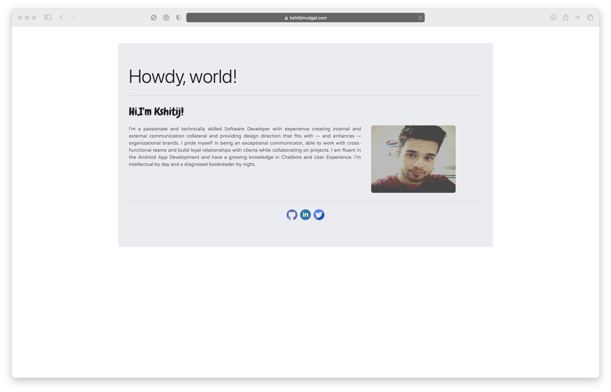
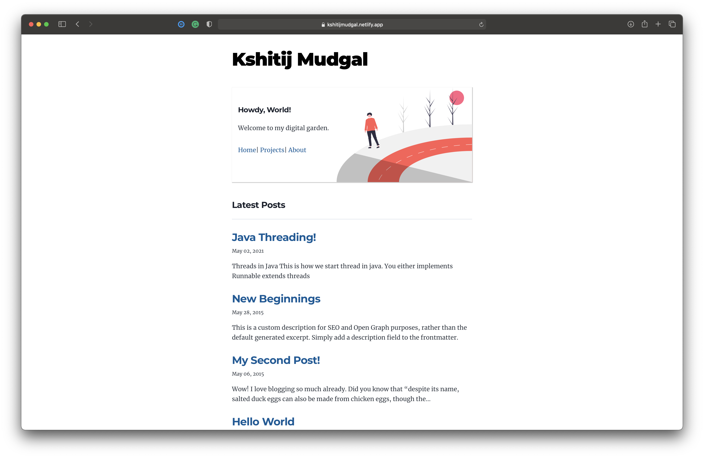

<hr />
<br>
Finally, Website 3.0 is here and it's all about blogs. My previous website was more a simple About Me site. I wanted to start blogging so either I could use micro-blogging sites like medium or I could add a blogging feature to my website.
<br/><br>

###Version 2.0 - Angular + Firebase
<hr>



When I made version 2.0 I intended to have a simple site with an about me section, my image, and links to my GitHub, LinkedIn, and Twitter accounts. But now I wanted to add more to my website. Moreover, a Portfolio website is a good way to showcase your talent as a software developer. You can compile your blogs, resume, and projects in a single place or we can call it a resume for your job interview.


Version 2.0 was made using,
    
        Angular 9.0 - Frontend
        Firebase    - Hosting
        Porkbun     - Domain
        

Back then I liked Angular and it felt cool and more like a software developer while making websites using Angular. Typescript made code manageable. Infact I liked the way Angular made your code structured. And for free Hosting I used Firebase. So $5 for domain name on [Porkbun](https://porkbun.com/) (it is good for first-timer) and that's it. The total development cost was just $5 for 1 year.

###Version 3.0 - React, Gatsby and Netlify
<hr>



Version 3.0 was quite challenging, I had some requirements in mind for v3
```
    1. It should have blogs!
    2. It should have about me.
    3. It should have my Projects list.

```

So there were two ways to do it
 1. Design complete Architecture: Backend, Databases, Deployment.
 2. Find a static site generator

Going with Option 1 was quite tricky as I have spent more time in development, it would take months to code it from scratch. Also, it will be costly as I need to pay for the Database and Deployment.  

So I did some research for Option 2, as it said
> "Don't try to reinvent the wheel."

Moreover, I could use this time to get ready for my blogs and work on some real projects.


####React 
<hr>


My first encounter with React wasn't pleasant, maybe because of Angular. I remembered my first course on scrimba and I didn't like JSX at all. It was messy including Html, CSS, and JS under one markup.
But now I feel react makes more sense for small projects- few lines of codes and boom your work is done.

Qutoing Maximilian Schwarzmüller -
> "React makes you a better Javascript developer."

And believe me it really does.


####Static Site Generator
<hr>
I tired following Static Site Generators:

1. **[Gatsby](https://www.gatsbyjs.com/)**
1. **[Next JS](https://nextjs.org/)**
3. **[HUGO](https://gohugo.io/)**

I picked Gatsby, reason: **its simple** 'period'.
Just upload md files, and you are done.

I used simple site templated and added few tweaks with pages and cards for navigation to make it more ME type website.

#### Hosting, Deployment
<hr>
Tough Competition:

```
    Gatsby Cloud
    Netlify
    AWS S3
    Github Pages
    Azure
    Heroku    
```

You can find more on deployment and hosting [here](https://www.gatsbyjs.com/docs/how-to/previews-deploys-hosting/).

For me netlify worked fine, I did use it earlier and interface is quite simple for me.

Finally, my website is ready version 3.0.